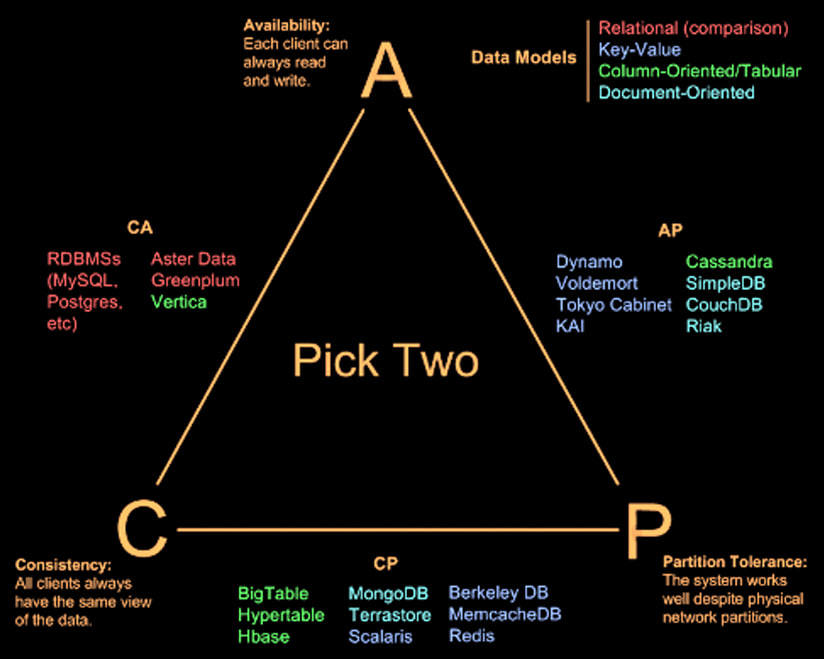

#  NoSQL Intro Summary

###  1. Schema

-   **Schema-less or Implicit Schema**: NoSQL databases often operate without a fixed schema, allowing for flexibility in data storage.
-   **Aggregate-based**: Data is stored in aggregates, which are collections of related objects.
-   **Key-value and Document-based**: These models store data as key-value pairs or documents, respectively.
-   **Graph Databases**: These are better suited for relationship-based data compared to relational databases.

### 2. Paradigmatic Shift in Big Data

-   **Schema On Write**: Traditional approach where data is structured at the time of writing, which can limit future analysis.
-   **Schema On Read**: Modern approach where data is stored in its raw form and structured only when read, allowing for more flexible analysis.

### 3. Logical Architecture of Big Data

-   **Data Ingestion**: Raw data is collected from various sources.
-   **Data Wrangling**: Data is cleaned and transformed.
-   **Big Data Long Term Storage**: Data is stored in formats optimized for querying, such as ORC or Parquet.
-   **Data Views**: Different views of the data are created for various analyses.

### 4. Data Lake

-   **Incoming Flow**: Raw data from various sources like emails, spreadsheets, and social media.
-   **Reservoir**: The dataset where analytics are run.
-   **Outflow**: Analyzed data that provides business insights.

### 5. Scalability

-   **Vertical Scalability**: Traditional SQL systems scale by adding more resources to a single machine.
-   **Horizontal Scalability**: Big Data solutions scale by adding more machines to the system.

### 6. Transactional Properties

-   **ACID Properties**: Atomicity, Consistency, Isolation, and Durability are essential for transactional systems.
-   **Atomicity**: Ensures that a transaction is all-or-nothing.
-   **Consistency**: Ensures that a transaction brings the database from one valid state to another.
-   **Isolation**: Ensures that concurrent transactions do not interfere with each other.
-   **Durability**: Ensures that once a transaction is committed, it remains so.

### 7. CAP Theorem

-   **Consistency**: All nodes see the same data at the same time.
-   **Availability**: Every request receives a response about whether it succeeded or failed.
-   **Partition Tolerance**: The system continues to operate despite network failures.
-   **Trade-off**: A distributed system can only guarantee two out of the three properties at the same time.

### 8. ACID vs. BASE

-   **ACID**: Focuses on strong consistency and reliability.
-   **BASE**: Focuses on availability and eventual consistency, allowing for more flexibility in distributed systems.

### 9. NoSQL Models

-   **Key-Value Store**: Stores data as key-value pairs (e.g., Redis, MemcacheDB).
-   **Column Store**: Stores data in columns rather than rows, useful for analytics (e.g., Cassandra, HBase).
-   **Document Store**: Stores data as documents (e.g., MongoDB, CouchDB).
-   **Graph Store**: Stores data in nodes and edges, ideal for relationship-based data (e.g., Neo4j).

### 10. Integration

-   **SQL and NoSQL Integration**: Combining traditional relational databases with NoSQL solutions to leverage the strengths of both.